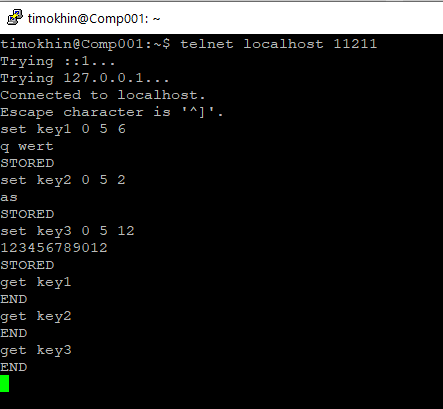
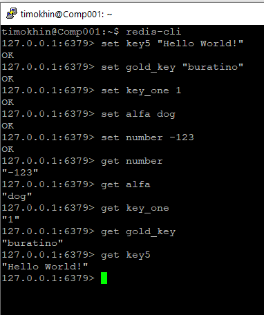
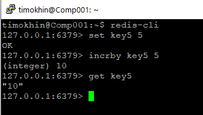

# Домашнее задание к занятию "Кеширование Redis/memcached" - `Тимохин Виталий`

### Задание 1.  Кеширование.

Приведите примеры проблем, которые может решить кеширование.
Приведите ответ в свободной форме.

`Кеширование — механизм, с помощью которого можно повысить скорость работы приложения за счёт переноса часто используемых данных в очень быстрое хранилище.
Кэширование очень активно используют во множестве систем. Например:
Внутренний кэш баз данных.
DNS кэш внутри нашего компьютера или браузера.
Кэш статического контента в браузере.
В любом приложении есть операции, которые долго выполнялись, но результат которых можно сохранить на какое-то время. Это позволит меньше выполнять таких операций и отдавать заранее сохранённые данные.
Можно кэшировать:
Запросы в базу данных.
Пользовательские сессии.
Медленные операции внутри приложения (расчеты, какие-то итоговые данные и т. д.)
Запросы к внешним системам.`

### Задание 2. Memcached.

Установите и запустите memcached.
Приведите скриншот systemctl status memcached, где будет видно, что memcached запущен.

### Задание 3. Удаление по TTL в Memcached.

Запишите в memcached несколько ключей с любыми именами и значениями, для которых выставлен TTL 5.
Приведите скриншот, на котором видно, что спустя 5 секунд ключи удалились из базы.

### Задание 4. Запись данных в Redis.

Запишите в Redis несколько ключей с любыми именами и значениями.
Через redis-cli достаньте все записанные ключи и значения из базы, приведите скриншот этой операции.

### Задание 5*. Работа с числами.

Запишите в Redis ключ key5 со значением типа "int" равным числу 5. Увеличьте его на 5, чтобы в итоге в значении лежало число 10.
Приведите скриншот, где будут проделаны все операции и будет видно, что значение key5 стало равно 10.

